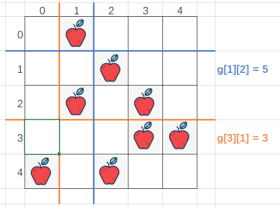

# LeetCode 1444 Notes: Number of Ways of Cutting a Pizza

This is a DP problem, if you understand the basic idea, it's a simple problem.

## Remark and Acknowledgement

Please refer to [this LeetCode Discussion](<https://leetcode.com/problems/number-of-ways-of-cutting-a-pizza/discuss/623759/C%2B%2B-DP-cutting-(with-picture-explanation)>) for more details.

## Basic Idea of DP

As the upper and left part is given to a person after each cut, we can think in a reverse way:

- if I know the ways of cutting of "a lower part" (say `n` cuts), I will know the ways of cutting if one more row is added to the top of that "lower part" (if the row added has at least one apple, than the possible cut is `n+1`).

- Similarly, if I know the ways of cutting of "a right part" (say `m` cuts), I will know the ways of cutting if one more column is added to the left of that "right part" (if the column added has at least one apple, than the possible cut is `m+1`).

And that's how DP works in this problem.

## How to represent apples?

As suggested before, we only increase the possible cut when "the row added to the top" and "the column added to the left" contain at least one apple, otherwise we can't make the cut at the first place, and the reverse approach makes no sense. So knowing whether a row or a column (or rows/columns) contains apple or not is important.

There are many ways of keeping track of where apple is located. Here, we use `g[r][c]` represent the number of apples in the gird `mat[r..][c..]` (lower-right rectangle), as shown in the figure below.

## How to construct DP array?

We need three dimensions for DP array, because there're three variables:

- Row: `r`
- Column: `c`
- Number of Cut: `l`

So, let `f[r][c][l]` denote the number of ways to cut `mat[r..][c..]` (lower-right rectangle) into `l` pieces. Our goal is to find `f[0][0][k]` (the lower-right rectangle from (0, 0) is the whole rectangle), so `f[0][0][k]` is the ways of cutting into `k` pieces.

## What is the DP relationship?

As mentioned before, if we can add one row to the top of "a lower part", we can add two, three, ... rows. As long as:

- the row(s) added contain at least one apple
- after adding, the same rectangle are formed

we can sum up their steps for the bigger rectangle.

As a result, the DP relationship is

$$
\begin{align}
f[r][c][l] &= \forall_{g[r][c]-g[i][c]>0} \sum_{i=r+1}^{n-1} f[i][c][l-1] \\
&+ \forall_{g[r][c]-g[r][j]>0} \sum_{i=c+1}^{m-1}f[r][j][l-1]
\end{align}
$$

## What is the time and space complexity?

- Time complexity: `O(m * n * MAX(m, n) * k)`:

  - `n`: number of row
  - `m`: number of column
  - `MAX(n, m)`: sum in DP relationship
  - `k`: number of cut

- Space complexity: `O(m\*n\*k)`
