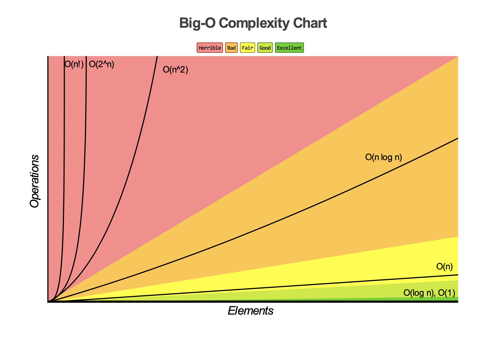
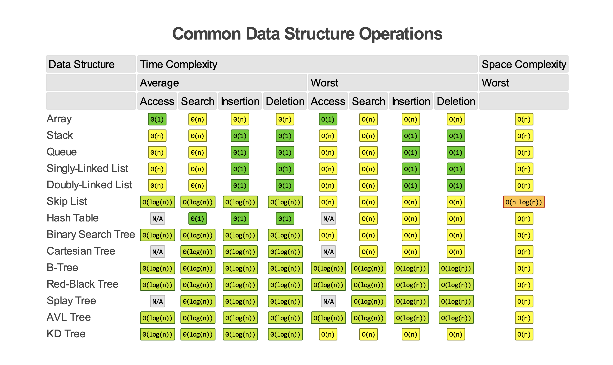
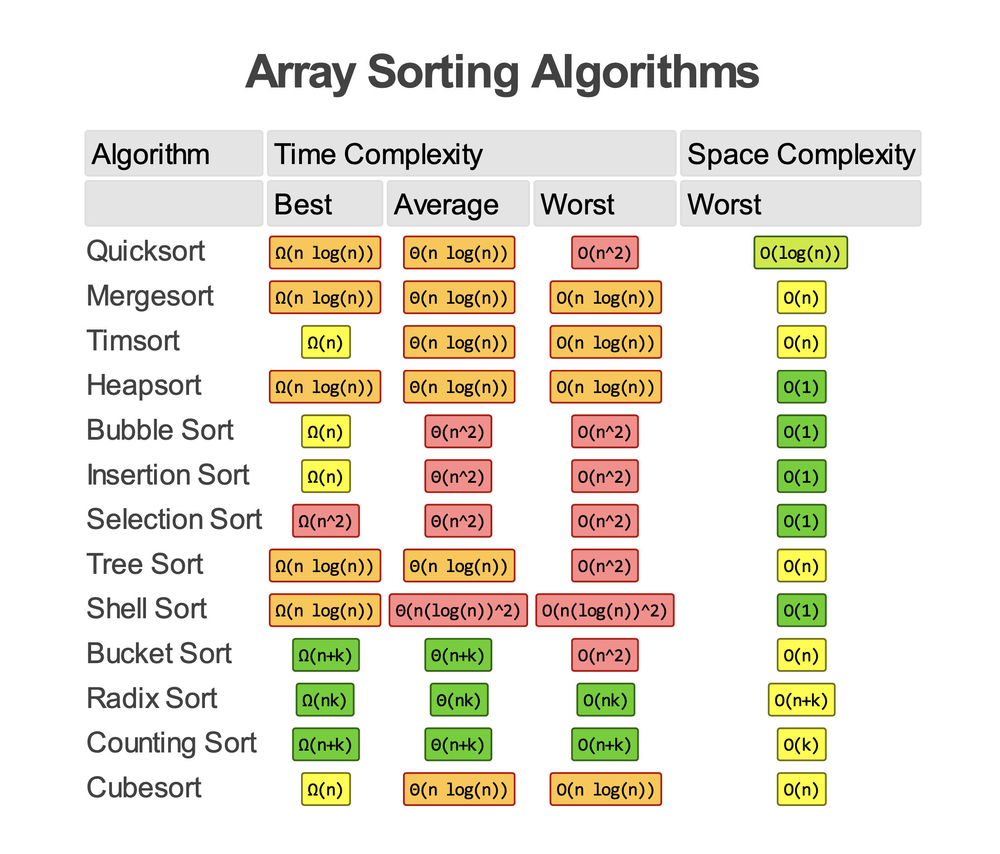
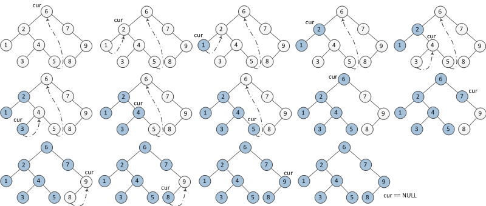

# Resources <!-- omit in toc -->

## Table of Content <!-- omit in toc -->

- [1. Big-O Cheat Sheet](#1-big-o-cheat-sheet)
  - [1.1 Big-O Chart](#11-big-o-chart)
  - [1.2 Data Structure](#12-data-structure)
  - [1.3 Sorting Algorithm](#13-sorting-algorithm)
- [2. Morris Traversal](#2-morris-traversal)
  - [2.1 In-order Morris Traversal](#21-in-order-morris-traversal)
  - [2.2 Pre-order Morris Traversal](#22-pre-order-morris-traversal)
  - [2.3 Post-order Morris Traversal](#23-post-order-morris-traversal)
- [3. Proof of Reservoir Sampling](#3-proof-of-reservoir-sampling)

## 1. Big-O Cheat Sheet

### 1.1 Big-O Chart

---

### 1.2 Data Structure

---

### 1.3 Sorting Algorithm

---

## 2. Morris Traversal
### 2.1 In-order Morris Traversal

- Step 0: set `cur` to `root`
- Step 1: if `cur->left` is `nullptr`
  - **print `cur`**
  - update `cur` to `cur->right`
- Step 2: if `cur->left` is not `nullptr`
  - find predecessor of `cur` (rightmost node of `cur`'s left sub-tree)
    - if `pre->right` is `nullptr` (not connected)
      - connect `pre->right` to `cur`
      - update `cur` to `cur->left`
    - if `pre->right` is `cur` (already connected)
      - set `pre->right` to `nullptr` (revert tree structure)
      - **print `cur`**
      - update `cur` to `cur->right`
- Step 3: if `cur` is not `nullptr`, Go to Step 1

---

### 2.2 Pre-order Morris Traversal

- Step 0: set `cur` to `root`
- Step 1: if `cur->left` is `nullptr`
  - **print `cur`**
  - update `cur` to `cur->right`
- Step 2: if `cur->left` is not `nullptr`
  - find predecessor of `cur` (rightmost node of `cur`'s left sub-tree)
    - if `pre->right` is `nullptr` (not connected)
      - connect `pre->right` to `cur`
      - **print `cur`**
      - update `cur` to `cur->left`
    - if `pre->right` is `cur` (already connected)
      - set `pre->right` to `nullptr` (revert tree structure)
      - update `cur` to `cur->right`
- Step 3: if `cur` is not `nullptr`, Go to Step 1

*Remarks: The only difference between in-order and pre-order traversal is the **timing of printing***

---

### 2.3 Post-order Morris Traversal

- Step 0:
  - create a `dummy` node
  - set `dummy->left` to `root`
  - set `cur` to `dummy`
- Step 1: if `cur->left` is `nullptr`
  - update `cur` to `cur->right`
- Step 2: if `cur->left` is not `nullptr`
  - find predecessor of `cur` (rightmost node of `cur`'s left sub-tree)
    - if `pre->right` is `nullptr` (not connected)
      - connect `pre->right` to `cur`
      - update `cur` to `cur->left`
    - if `pre->right` is `cur` (already connected)
      - set `pre->right` to `nullptr` (revert tree structure)
      - **Reverse print from `cur->left` to predecessor**
      - set `cur` to `cur->right`
- Step 3: if `cur` is not `nullptr`, Go to Step 1

*Remarks: The only different between post-order and other two traversals is the **timing and method of printing***

---

## 3. Proof of Reservoir Sampling

- Goal: Select $k$ entries from $n$ options $\{X_1, X_2,...,X_n\}$. For any $n\ge k$, each entry is selected with same probability $P(X_i)=\frac{k}{n}$.

- Procedures:
  - Choose $\{X_1, X_2,..., X_k\}$ first and put them into the reservoir
  - For $i\in [1,n-k]$, do:
    1. Pick $X_{k+i}$ with probability $P(X_{k+i})=\frac{k}{k+i}$
    2. If $X_{k+i}$ is picked, randomly replace an entry in the reservoir with same probability

- Proof: **Mathematical Induction**
  - Initial condition $n=k$: $\{X_1, X_2,..., X_k\}$ are all in the reservoir.
  - Keep $k$ constant and increase $n$.
  - When $n=k+1$:
    - $X_{k+1}$ is picked with $P(X_{k+1})=\frac{k}{k+1}=\frac{k}{n}$
    - For $j=1,2,...,k$, the probability of $X_j$ is not being replaced is $P(X_j) = 1-\frac{k}{n}\cdot\frac{1}{k}=\frac{n-1}{n}=\frac{k}{n}$
  - Assume $n=k+i$ is true:
    - For $j\in[1,k+i]$, the probability of $X_j$ is in the reservoir is $P(X_{k+i})=\frac{k}{k+i}$
  - When $n=k+i+1$:
    - For $j=k+i+1$, $X_j$ is picked with $P(X_j)=\frac{k}{k+i+1}=\frac{k}{n}$
    - For $j\in[1,k+i]$, the probability of $X_j$:
      1. in the reservoir last round: $\frac{k}{k+i}$
      2. not being replaced: $1-\frac{k}{k+i+1}\cdot\frac{1}{k}$

      So $P(X_j) = \frac{k}{k+i}\cdot\left(1-\frac{k}{k+i+1}\cdot\frac{1}{k}\right)=\frac{k}{k+i}\cdot\frac{k+i}{k+i+1}=\frac{k}{n}$
  - Q.E.D.

## Reference <!-- omit in toc -->
1. Big-O Cheat Sheet. [https://www.bigocheatsheet.com](https://www.bigocheatsheet.com)
