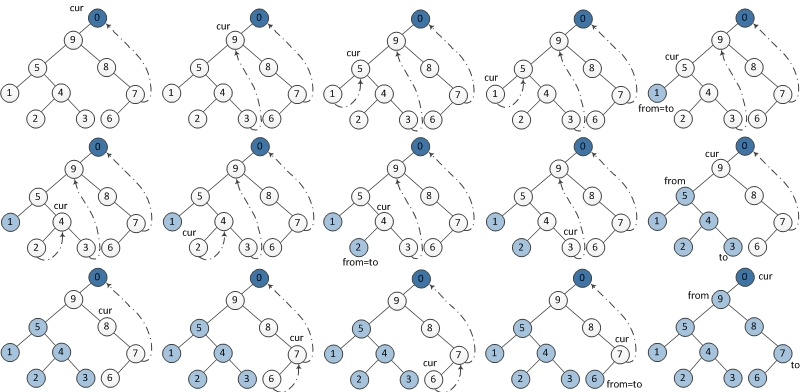

# Resources <!-- omit in toc -->

## Table of Content: <!-- omit in toc -->

- [1. Big-O Cheat Sheet](#1-big-o-cheat-sheet)
  - [1.1 Big-O Chart](#11-big-o-chart)
  - [1.2 Data Structure](#12-data-structure)
  - [1.3 Sorting Algorithm](#13-sorting-algorithm)
- [2. Morris Traversal](#2-morris-traversal)
  - [2.1 In-order Morris Traversal](#21-in-order-morris-traversal)
  - [2.2 Pre-order Morris Traversal](#22-pre-order-morris-traversal)
  - [2.3 Post-order Morris Traversal](#23-post-order-morris-traversal)

## 1. Big-O Cheat Sheet

### 1.1 Big-O Chart

### 1.2 Data Structure

### 1.3 Sorting Algorithm

## 2. Morris Traversal
### 2.1 In-order Morris Traversal

- Step 0: set `cur` to `root`
- Step 1: if `cur->left` is `NULL`
  - **print `cur`**
  - update `cur` to `cur->right`
- Step 2: if `cur->left` is not `NULL`
  - find predecessor of `cur` (rightmost node of `cur`'s left sub-tree)
    - if `pre->right` is `NULL` (not connected)
      - connect `pre->right` to `cur`
      - update `cur` to `cur->left`
    - if `pre->right` is `cur` (already connected)
      - set `pre->right` to `NULL` (revert tree structure)
      - **print `cur`**
      - update `cur` to `cur->right`
- Step 3: if `cur` is not `NULL`, Go to Step 1

### 2.2 Pre-order Morris Traversal

- Step 0: set `cur` to `root`
- Step 1: if `cur->left` is `NULL`
  - **print `cur`**
  - update `cur` to `cur->right`
- Step 2: if `cur->left` is not `NULL`
  - find predecessor of `cur` (rightmost node of `cur`'s left sub-tree)
    - if `pre->right` is `NULL` (not connected)
      - connect `pre->right` to `cur`
      - **print `cur`**
      - update `cur` to `cur->left`
    - if `pre->right` is `cur` (already connected)
      - set `pre->right` to `NULL` (revert tree structure)
      - update `cur` to `cur->right`
- Step 3: if `cur` is not `NULL`, Go to Step 1

*Remarks: The only difference between in-order and pre-order traversal is the **timing of printing***

### 2.3 Post-order Morris Traversal

- Step 0:
  - create a `dummy` node
  - set `dummy->left` to `root`
  - set `cur` to `dummy`
- Step 1: if `cur->left` is `NULL`
  - update `cur` to `cur->right`
- Step 2: if `cur->left` is not `NULL`
  - find predecessor of `cur` (rightmost node of `cur`'s left sub-tree)
    - if `pre->right` is `NULL` (not connected)
      - connect `pre->right` to `cur`
      - update `cur` to `cur->left`
    - if `pre->right` is `cur` (already connected)
      - set `pre->right` to `NULL` (revert tree structure)
      - **Reverse print from `cur->left` to predecessor**
      - set `cur` to `cur->right`
- Step 3: if `cur` is not `NULL`, Go to Step 1

*Remarks: The only different between post-order and other two traversals is the **timing and method of printing***

## Reference <!-- omit in toc -->
1. Big-O Cheat Sheet. [https://www.bigocheatsheet.com](https://www.bigocheatsheet.com)
